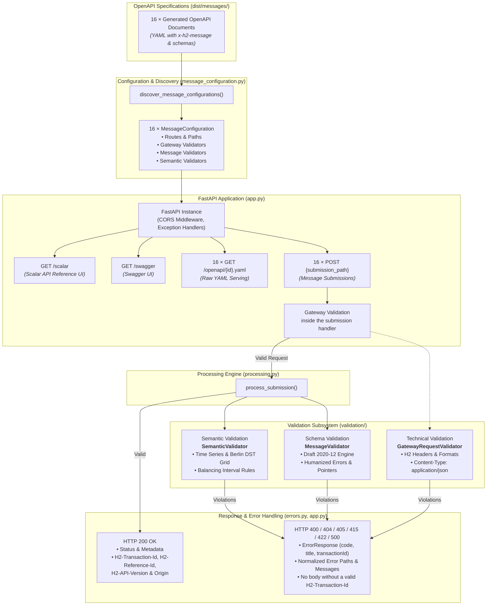
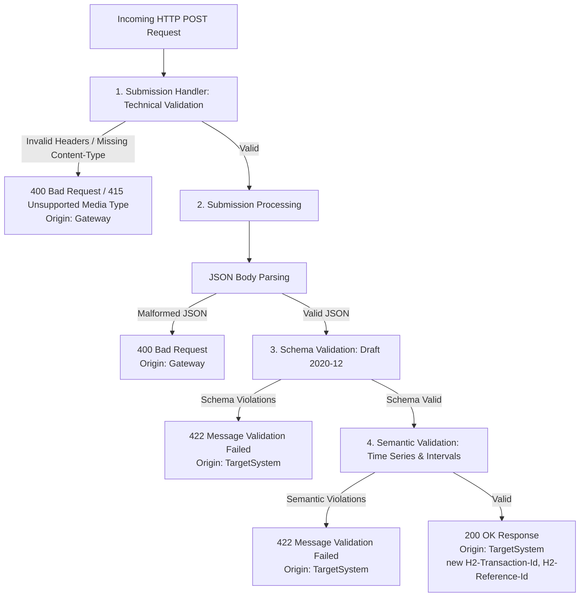

# Lean H2 Mock Backend

This deliberately small FastAPI application exposes all 16 POST operations found in the generated OpenAPI documents under `dist/messages/`. It is intended for local contract and stateless semantic testing, not as a reference implementation or production target system.

## Start

From the repository root:

```powershell
python -m pip install -r requirements-dev.txt
python -m uvicorn mock_backend.app:app --reload --port 8000
```

Open Scalar at `http://127.0.0.1:8000/scalar` or Swagger UI at `http://127.0.0.1:8000/swagger`.

The source repository is not needed: semantic validation uses the bundled copy in `_vendor/h2_message_validation/`, which `generate-all` refreshes together with the specifications (see `SOURCE.json` for the source commit).

## Trying requests in Scalar and Swagger UI

The specifications declare the server URL `/`, so "Test Request" in Scalar and "Try it out" in Swagger UI send requests to the mock itself. The examples embedded in the specifications are accepted when sent with the example header values. The mock does not check mutual TLS, so no client certificate is needed.

## Architecture



## What it validates



Every configured endpoint validates only:

- required H2 headers and their technical formats;
- that `H2-Business-Process` contains the value declared by the selected OpenAPI operation;
- JSON media type and JSON syntax, including rejection of `NaN`, `Infinity`, and `-Infinity` numeric constants;
- the request body against the generated OpenAPI message schema;
- stateless period and time-series semantics for message families that contain those structures;
- the relationship between intervals in balancing messages.

Within each gateway or schema stage, validation aggregates independent failures. A gateway failure stops processing before schema validation. Each nested item in `errors` contains exactly `path` and `message`.

Gateway checks run inside the submission handler so CORS headers are also applied to gateway error responses.

`H2-Business-Process` validation is only a gateway header check. It does not apply business-process rules to the body.

Header and schema violations use normalized human-readable messages instead of raw validator wording, and errors are ordered by path with array indices in numeric order. Every nested error remains limited to `path` and `message`.

A pattern's `$` anchor and date-time values reject a trailing newline, as JSON Schema's ECMA-262 regular expressions require, so a value such as `"9700123456789\n"` does not satisfy `^[0-9]{13}$`. All other pattern syntax is still evaluated by Python's `re` module; for example, `\d` also matches non-ASCII digits there, whereas `[0-9]` behaves the same in both.

Scalar and Swagger UI label each source with its canonical `TYPE / SubType`, for example `MEASUREMENT / Final`. They deliberately do not reuse inconsistent `info.title` boilerplate, language, or release suffixes.

## Responses

The mock returns only the responses its checks can produce:

| Status | When | `responseOrigin` |
|---|---|---|
| `200` | Headers, JSON, schema and semantics are valid | `TargetSystem` |
| `400` | Missing or invalid H2 headers (including a wrong `H2-Business-Process`) or malformed JSON | `Gateway` |
| `404` | Unknown path | `Gateway` |
| `405` | Wrong HTTP method; `Allow` lists the permitted methods | `Gateway` |
| `415` | `Content-Type` is not `application/json` | `Gateway` |
| `422` | Schema or semantic violations | `TargetSystem` |
| `500` | Unexpected error in the mock | `Gateway` |

Every response carries `H2-API-Version` and `H2-Response-Origin`. A response with a body is an `ErrorResponse` or success body as `application/json`, with a newly generated UUID version 7 in `H2-Transaction-Id` and the effective transaction ID of the request (`H2-Initial-Transaction-Id` on a retry, otherwise `H2-Transaction-Id`) in `H2-Reference-Id` and the error body's `transactionId`. If the request has no syntactically valid `H2-Transaction-Id`, the error response has no body and neither of these two headers.

Differences from the specifications:

- `401`, `403`, `409`, `429`, `502`, `503` and `504` are documented for the real gateway and target systems, but the mock never returns them. It checks neither mutual TLS nor authorization.
- `500` is not documented in the specifications.
- The `H2-API-Version` of a `404` for a path that belongs to no specification is the version shared by all specifications.

## Deliberate exclusions

The mock has no business, reference-data, state, idempotency, duplicate-document, or target-system simulation rules. Its semantic checks use only the submitted payload; they do not authorize parties, resolve market master data, or compare messages with prior submissions. It does not compare sender or recipient headers with body parties. A schema-valid and semantically consistent request can therefore be accepted even when those values differ, and sending the same transaction ID and body repeatedly succeeds.

## Tests

| File | Covers |
|---|---|
| `tests/test_mock_backend_lean.py` | Routes, Scalar and Swagger labels, acceptance of every embedded example, header and JSON errors, response headers and transaction IDs, `404`/`405`, CORS on error responses |
| `tests/test_mock_backend_schema_messages.py` | Human-readable schema error messages, error paths and ordering |
| `tests/test_mock_backend_semantic_validation.py` | Semantic period and time-series rules, including Berlin daylight-saving days and balancing intervals |

```powershell
python -m pytest -q tests/test_mock_backend_lean.py tests/test_mock_backend_schema_messages.py tests/test_mock_backend_semantic_validation.py
ruff check .
```
